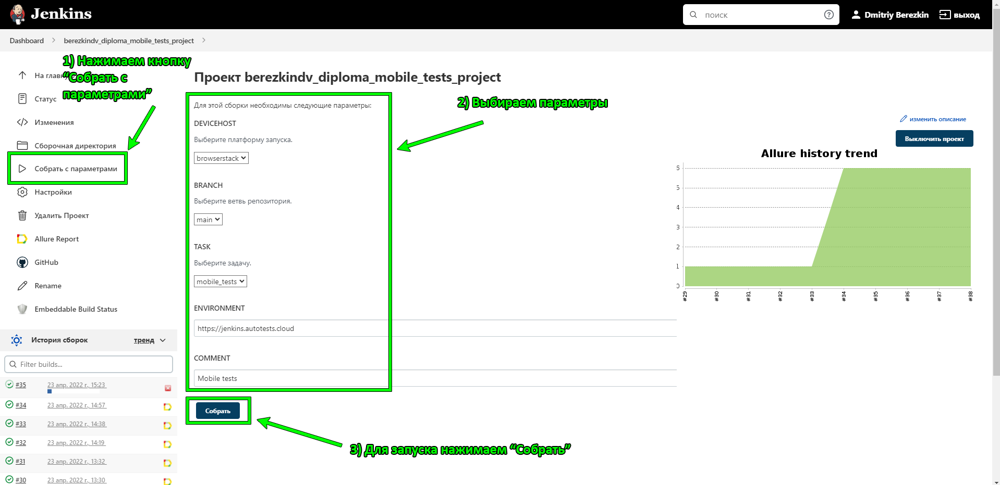
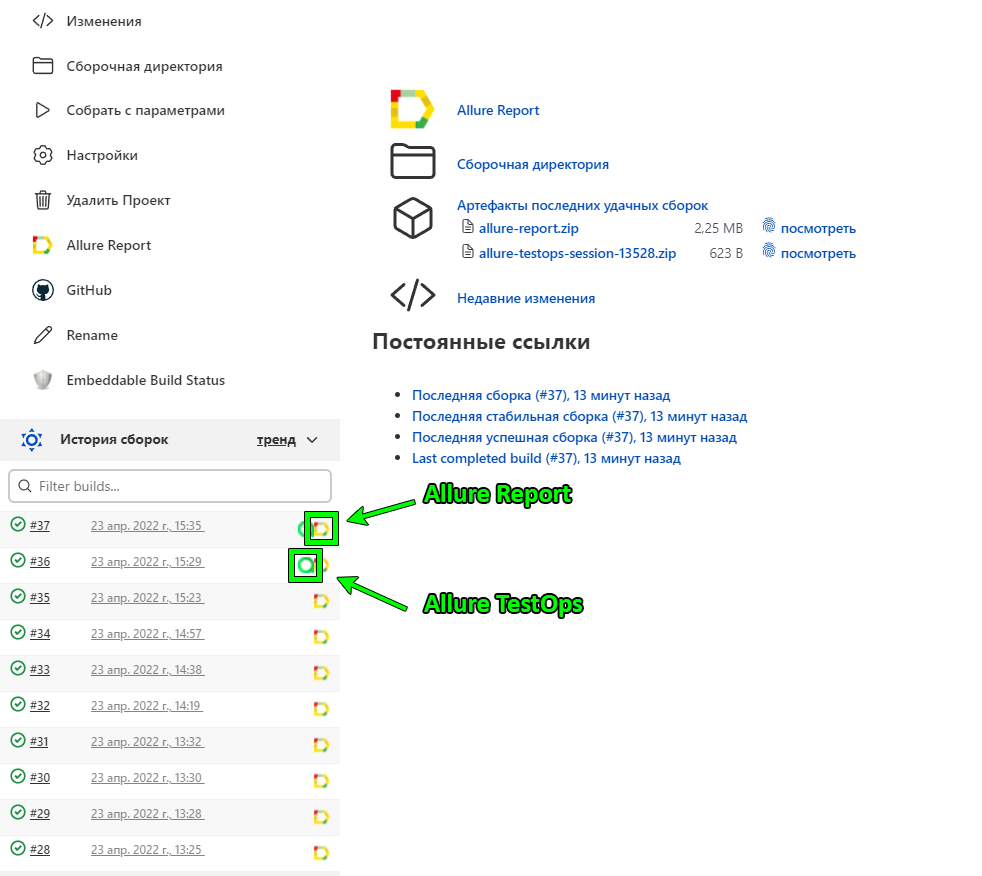
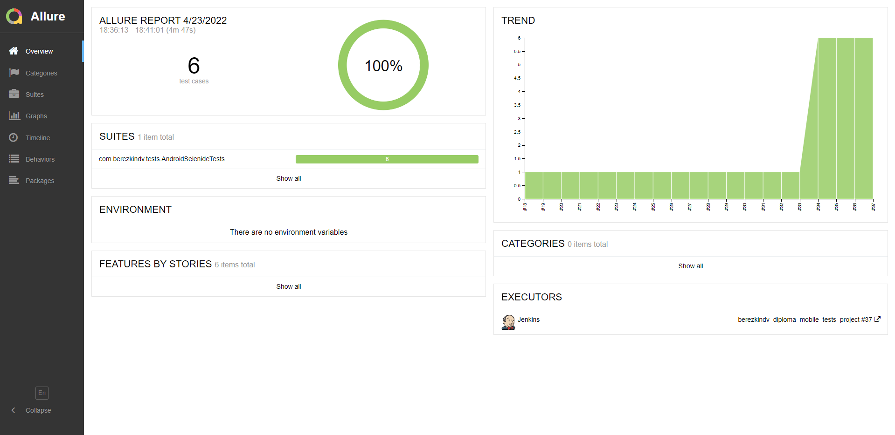
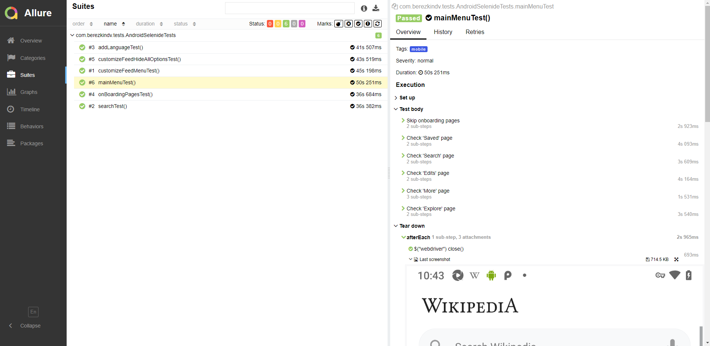
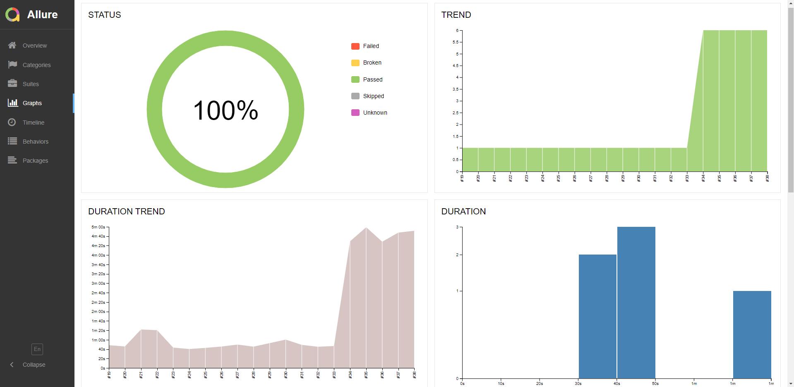
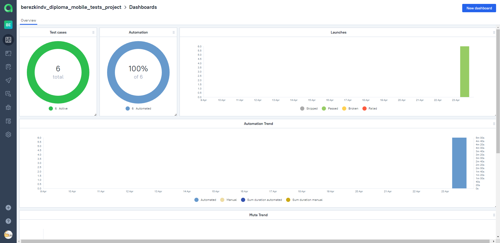
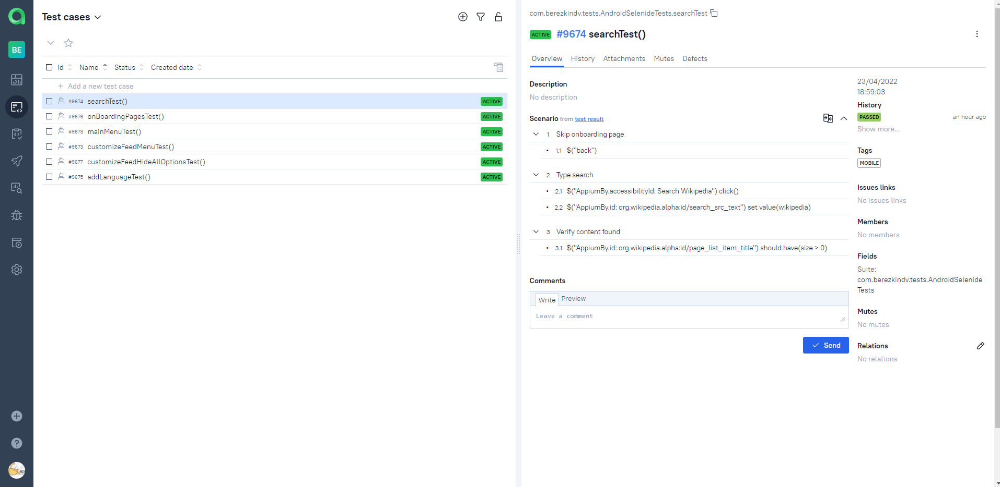
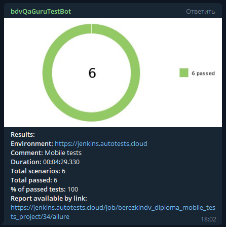

# Дипломный проект по тестированию мобильного приложения Wikipedia для Android
### <a target="_blank" href="https://https://ru.wikipedia.org">Wikipedia</a>

### <a target="_blank" href="https://https://github.com/wikimedia/apps-android-wikipedia">Wikipedia mobile app</a>

[//]: # (## </a>Содержание)
## :robot: Содержание

- [Технологии и инструменты](#rocket-технологии-и-инструменты)
- [Тест кейсы](#scroll-тест-кейсы)
- [Параметры запуска тестов](#computer-параметры-запуска-тестов)
- [Сборка в Jenkins](#сборка-в-jenkins)
- [Allure отчет](#отчет-в-allure-report)
- [Интеграция с Allure TestOps](#интеграция-с-allure-testops)
- [Отчет в Telegram](#уведомление-в-telegram-при-помощи-бота)
- [Примеры видео о прохождении тестов](#примеры-видео-о-прохождении-тестов)

## :rocket: Технологии и инструменты

<p align="center">
<a href="https://www.java.com/"></a>
<a href="https://www.jetbrains.com/idea/"></a>
<a href="https://github.com/"></a>
<a href="https://junit.org/junit5/"></a>
<a href="https://gradle.org/"></a>
<a href="https://selenide.org/"></a>
<a href="https://github.com/allure-framework/allure2"></a>
<a href="https://www.browserstack.com/"></a>
<a href="https://appium.io/"></a>
<a href="https://developer.android.com/studio"></a>
<a href="https://www.jenkins.io/"></a>
<a href="https://qameta.io/"></a>

[//]: # (<a href="https://aerokube.com/selenoid/"></a>)
[//]: # (<a href="https://www.docker.com/"></a>)
</p>

## :scroll: Тест кейсы

- ✓ Тест страниц приветствия.
- ✓ Тест поиска.
- ✓ Тест перехода в меню настройки ленты.
- ✓ Тест настройки ленты, отключение всех опций.
- ✓ Тест добавления русского языка.
- ✓ Тест пунктов основного меню.


[К содержанию](#Содержание)

## :computer: Параметры запуска тестов

### Локальный запуск:
Паттерн запуска из терминала выглядит следующим образом: \
```gradle clean task -DdeviceHost=deviceHost``` \
task в данном случае один - mobile_tests \
ключ deviceHost определяет на какой площадке будут запущены тесты
- ```browserstack``` - тесты будут запущены на платформе <a target="_blank" href="hhttps://www.browserstack.com/">BrowserStack</a>
- ```emulator``` - тесты будут запущены на локально развернутом эмуляторе <a target="_blank" href="https://developer.android.com/studio">Android Studio</a>
- ```real``` - тесты будут запущены на реальном девайсе

Промер:
```bash
Gradle clean mobile_tests -DdeviceHost=browserstack
```

Запуск сборки в Jenkins производится со следующими параметрами:
```bash
clean
${TASK}
-DdeviceHost=${DEVICEHOST}
```

### Параметры сборки в Jenkins:

- ```DEVICEHOST``` - Выбор платформы запуска (по умолчанию ```browserstack```)
- ```BRANCH``` - выбор ветки репозитория GitHub (по умолчанию ```main```)
- ```TASK``` - выбор задачи (настройка build.gradle, по умолчанию ```mobile_tests```)


[К содержанию](#Содержание)

## </a>Сборка в Jenkins
### <a target="_blank" href="https://jenkins.autotests.cloud/job/berezkindv_diploma_mobile_tests_project/">Jenkins</a>

Инструкция по запуску сборки в Jenkins:
<p align="center">
<a></a>
</p>

По завершении сборки можно посмотреть Allure отчет или перейти к Allure TestOps:
<p align="center">
<a></a>
</p>

[К содержанию](#Содержание)

## </a>Отчет в <a target="_blank" href="https://jenkins.autotests.cloud/job/berezkindv_diploma_ui_tests_project/10/allure/">Allure report</a>

### Основное окно

<p align="center">

</p>

### Тесты

<p align="center">

</p>

### Графики

<p align="center">

</p>

[К содержанию](#Содержание)

## </a>Интеграция с <a target="_blank" href="https://allure.autotests.cloud/launch/12018">Allure TestOps</a>

### Дашборд

<p align="center">

</p>

### Тест-кейсы

<p align="center">

</p>

[К содержанию](#Содержание)

## </a>Уведомление в Telegram при помощи бота
По завершении всех операций телеграм бот отправит отчет со статистикой:
<p align="center">

</p>

[К содержанию](#Содержание)


### </a>Примеры видео о прохождении тестов

<p align="center">


</p>

[К содержанию](#Содержание)